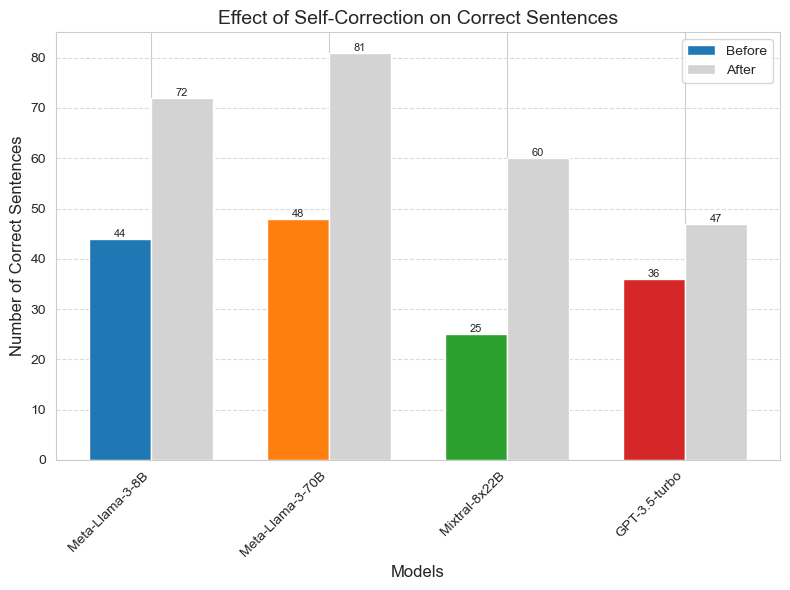

# Combining Large Language Model with Logical Symbolic Solver for Multi-hop Problems in RAG

## Introduction
This project addresses the challenge of handling multi-hop queries in Retrieval-Augmented Generation (RAG) systems. By integrating a Large Language Model (LLM) with a logical symbolic solver, we aim to enhance reasoning capabilities across diverse pieces of supporting evidence.

## Team Members
- 20280053 - Cao Huỳnh Anh Khoa
- 20280099 - Trần Minh Tiến

## Libraries
Ensure you have the necessary packages installed by running:
```
pip install -r requirements.txt
```

## Set working enviroment

If using default arguments, plase set your API in the `pyproject.toml` file, located in the same directory as the root folder. Define `API_KEY` as the AnyScale API key and `OPENAI_KEY` as the OpenAI key.

```toml
# pyproject.toml file
[api_keys]
API_KEY = 'YOUR-ANYSCALE-API-KEY'
OPENAI_KEY = 'YOUR-OPENAI-KEY'

```

Set `openai=True` in `read_api_key` function if using OpenAI key in `./models/logic_inference.py` and `self-refinement.py`

```
api_key = read_api_key('pyproject.toml', openai=True)
```

## Logic Program Generation
To generate logic programs for logical reasoning problems in the dataset:
```bash
python models/logic_program.py \
    --api_key "Your OpenAI/Anyscale API Key" \
    --model_name "Model Name [meta-llama/Meta-Llama-3-8B-Instruct | meta-llama/Meta-Llama-3-70B-Instruct | mistralai/Mixtral-8x22B-Instruct-v0.1 | GPT-3.5-turbo]" \
    --prompt_path "./models/prompts/prover9-parsrer.txt" \
    --input_dataset "./data/dataset.json" \
    --output_path "./outputs/logic_programs"
```
The generated logic programs will be saved in `outputs/logic_programs`.

## Logic Inference with Symbolic Solver (Prover9)
Perform inference with symbolic solvers using the generated logic programs:
```bash
python models/logic_program.py \
    --json_path "Your logic program results json path" \
    --output_path "./outputs/logic_inference/"
```
The logic reasoning results will be saved in `outputs/logic_inferences`.
*Note*: Current Prover9 solver in this project only works in a Linux environment.
## Self-Refinement
For self-refinement, execute:
```bash
python error_refiner.py \
    --prompt_path "./models/prompts/self-correct.txt" \
    --json_path "Your logic inference results json path" \
    --api "Your OpenAI/Anyscale API Key" \
    --model_name  "Model Name [meta-llama/Meta-Llama-3-8B-Instruct | meta-llama/Meta-Llama-3-70B-Instruct | mistralai/Mixtral-8x22B-Instruct-v0.1 | GPT-3.5-turbo]" \
    --output_folder "./outputs/self-refinement/"
```
The self-refinement results will be saved in `outputs/self-refinement`.

Result before and after using self-refinement


